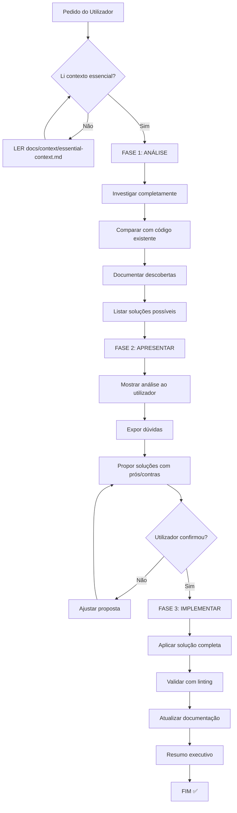

# 🤖 AI Memory Rules - Regras Fundamentais para IA

**Status:** CRÍTICO - Leitura OBRIGATÓRIA antes de qualquer ação  
**Última Atualização:** 2025-12-05  
**Contexto:** Projeto GSPackages - Biblioteca de Componentes React

---

## ⚠️ LEMBRETE OBRIGATÓRIO - CONSULTAR SEMPRE

**Antes de QUALQUER modificação no código, a IA DEVE:**

1. ✅ **Ler contexto essencial** → `docs/context/essential-context.md`
2. ✅ **Verificar checklist** → `docs/progress/PACKAGES-CHECKLIST.md`
3. ✅ **Seguir workflow oficial** → `docs/indices/analyze-then-act-workflow.md`
4. ✅ **Aplicar guidelines** → `docs/indices/communication-guidelines.md`

---

## 🎯 Princípios Fundamentais

### 1. 🔍 ANÁLISE ANTES DE AÇÃO (OBRIGATÓRIO)

**NUNCA modificar código sem análise completa primeiro!**

```
❌ MAU: Ver erro → Aplicar fix imediatamente
✅ BOM: Ver erro → Investigar completamente → Propor soluções → Aguardar confirmação → Implementar
```

**Workflow oficial:** 3 fases (Análise → Apresentar → Implementar)  
**Documentação:** `docs/indices/analyze-then-act-workflow.md`

### 2. 💬 COMUNICAÇÃO CLARA (OBRIGATÓRIO)

**NUNCA ASSUMIR - SEMPRE PERGUNTAR!**

```
❌ MAU: "Vou assumir que queres X e implementar"
✅ BOM: "Identifiquei X. Tenho dúvidas sobre Y. Proponho soluções A ou B. O que preferes?"
```

**Guidelines:** `docs/indices/communication-guidelines.md`

### 3. 📚 DOCUMENTAÇÃO PRIMEIRO (OBRIGATÓRIO)

**SEMPRE consultar documentação existente antes de criar/modificar:**

- ✅ READMEs de componentes
- ✅ Padrões similares (usar `codebase_search`)
- ✅ Índices e checklists
- ✅ Contexto essencial

### 4. 🧪 ZERO FRAMEWORKS EXTERNOS (CRÍTICO)

**Princípio agnóstico - Package-ready:**

```
✅ PERMITIDO:
- @carlos-gs99/primitives (nossos primitivos headless)
- @carlos-gs99/theme (tokens CSS)
- @carlos-gs99/hooks (hooks internos)
- @carlos-gs99/utils (utils internos)
- @tanstack/react-table (headless utility - exceção documentada)

❌ PROIBIDO:
- Base UI, MUI, Bootstrap, Chakra UI (frameworks de UI)
- Qualquer library que force estilos ou estrutura visual
```

**Documentação:** `docs/packaging/acceptable-exceptions.md`

---

## ✅ Checklist Obrigatório Antes de Qualquer Ação

### Antes de Modificar Código:

- [ ] Li `docs/context/essential-context.md`?
- [ ] Consultei README do componente?
- [ ] Verifiquei padrões similares com `codebase_search`?
- [ ] Li `docs/progress/PACKAGES-CHECKLIST.md` para ver status?
- [ ] Segui workflow de 3 fases (Análise → Apresentar → Implementar)?
- [ ] Expus TODAS as dúvidas ao utilizador?
- [ ] Propus soluções ANTES de implementar?
- [ ] Aguardei confirmação do utilizador?

### Antes de Criar Novo Componente:

- [ ] Componente não existe já no projeto?
- [ ] Não duplica funcionalidade existente?
- [ ] Zero dependências em frameworks externos (Base UI, MUI, Bootstrap)?
- [ ] Usa primitivos de `@carlos-gs99/primitives`?
- [ ] Segue estrutura de packlet (pasta isolada)?
- [ ] CSS Modules + tokens CSS (sem inline/interno)?
- [ ] i18n implementado (en.json, pt.json, helper)?
- [ ] Acessibilidade (ARIA, keyboard nav)?
- [ ] Debug mode (useDebug, data-gs)?
- [ ] Documentação completa (README.md)?

### Antes de Modificar Componente:

- [ ] Li README do componente?
- [ ] Entendi props existentes (types.ts)?
- [ ] Verifiquei dependências atuais (package.json)?
- [ ] Validei que mudança não quebra API pública?
- [ ] Considerei backward compatibility?
- [ ] Testes existentes continuam a passar?

### Após Modificação:

- [ ] Atualizei documentação (README.md)?
- [ ] Atualizei types.ts com TSDoc?
- [ ] Atualizei PACKAGES-CHECKLIST.md se necessário?
- [ ] Executei linting e corrigi erros?
- [ ] Verifiquei que build passou?
- [ ] Testes continuam a passar (ou criei novos)?

---

## 🛠️ Ferramentas Obrigatórias

### 1. `codebase_search` - USAR SEMPRE

**Quando:**
- Procurar padrões similares
- Entender como outros componentes fazem X
- Verificar se funcionalidade já existe
- Encontrar exemplos de uso

**Exemplo:**
```
Query: "Como implementar ripple effect em componentes GS?"
Target: ["gs-button", "gs-checkbox"]
```

### 2. `grep` - Para Busca Exata

**Quando:**
- Procurar uso específico de função/componente
- Verificar imports
- Encontrar todas as referências a X

**Exemplo:**
```bash
grep --pattern "useDebug" --path "GSPackages/gs-*"
```

### 3. `read_file` - Entender Implementações

**Quando:**
- Ler README de componente
- Entender types.ts
- Ver implementação existente

### 4. MCP Context7 - Documentação Externa

**Quando:**
- Consultar docs de bibliotecas externas
- Verificar APIs de dependências
- Resolver dúvidas sobre packages npm

---

## 🚫 PROIBIÇÕES ABSOLUTAS

### ❌ NUNCA Fazer:

1. **Modificar código sem análise primeiro**
   - Consequência: Mudanças precipitadas, incompletas ou desnecessárias

2. **Assumir requisitos não explícitos**
   - Consequência: Implementar funcionalidade errada

3. **Ignorar dúvidas identificadas**
   - Consequência: Decisões mal-informadas

4. **Adicionar dependências de frameworks UI externos**
   - Consequência: Quebra princípio agnóstico, package não publicável

5. **Criar componente sem verificar se já existe**
   - Consequência: Duplicação de código, inconsistência

6. **Implementar sem propor soluções primeiro**
   - Consequência: Retrabalho, desperdício de tempo

7. **Usar estilos inline ou !important**
   - Consequência: CSS difícil de manter, baixa modularidade

8. **Componente sem i18n (en.json, pt.json)**
   - Consequência: UI não internacionalizável

9. **Componente sem acessibilidade (ARIA, keyboard)**
   - Consequência: Inacessível para utilizadores com deficiências

10. **Componente sem testes**
    - Consequência: Baixa qualidade, bugs não detectados

---

## 📊 Workflow Resumido



---

## 🎯 Metas de Qualidade

Cada componente DEVE ter:

| Requisito | Meta | Validação |
|-----------|------|-----------|
| **Isolamento** | 100% | Tudo na pasta do componente |
| **Zero deps externas** | 100% | package.json limpo |
| **CSS Modules** | 100% | Sem inline/interno |
| **i18n** | 100% | en.json + pt.json |
| **A11y** | WCAG AA | ARIA + keyboard nav |
| **Debug mode** | 100% | useDebug integrado |
| **Testes** | 80%+ coverage | unit + a11y + i18n |
| **Documentação** | 100% | README.md completo |
| **TypeScript** | 100% strict | Types completos |

---

## 📚 Referências Rápidas

### Documentação Essencial
- **Contexto:** `docs/context/essential-context.md`
- **Checklist:** `docs/progress/PACKAGES-CHECKLIST.md`
- **Workflow:** `docs/indices/analyze-then-act-workflow.md`
- **Comunicação:** `docs/indices/communication-guidelines.md`
- **Plano Testes:** `docs/progress/TEST-PLAN.md`

### Templates
- **Componente:** `docs/packaging/component-template.md` (criar)
- **Testes:** Ver `gs-spinner/__tests__/` como exemplo

### Índices
- **Componentes:** 42 packages em `GSPackages/`
- **Status:** `docs/progress/PACKAGES-CHECKLIST.md`
- **Progresso:** `docs/progress/SESSION-2025-12-04.md`

---

## 🚨 CRÍTICO - Ler Primeiro

Se esta é a tua primeira ação numa nova sessão:

1. **LER AGORA:** `docs/context/essential-context.md`
2. **VERIFICAR:** `docs/progress/PACKAGES-CHECKLIST.md`
3. **CONSULTAR:** `docs/progress/TEST-PLAN.md` (se trabalhar em testes)
4. **SEGUIR:** Workflow de 3 fases SEMPRE

---

**Este documento é a BÍBLIA da IA para este projeto. Segue religiosamente!** 🙏

